# Diagramas de Flujo - Proyecto SGA-NYC
## Todos los diagramas en formato Mermaid para mermaid.live

---

## 1. FUNCIÓN: main()
**Archivo:** FinalProject.c  
**Descripción:** Orquesta la aplicación, muestra menú principal y despliega opciones.

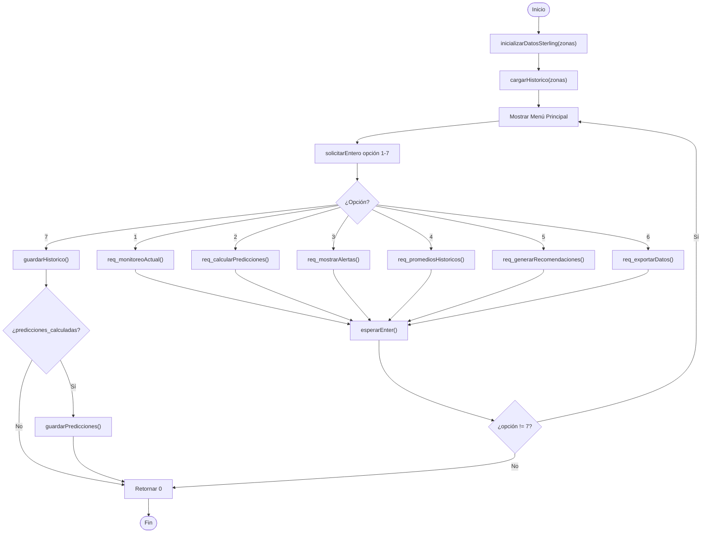

---

## 2. FUNCIÓN: generarInterpretacionClimatica()
**Archivo:** climate.c  
**Descripción:** Genera descripción textual basada en temperatura y velocidad de viento.

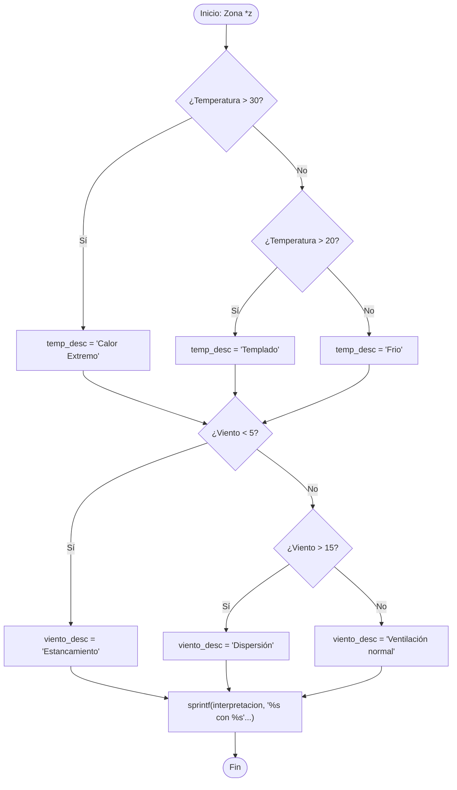

---

## 3. FUNCIÓN: req_calcularPredicciones()
**Archivo:** climate.c  
**Descripción:** Calcula predicción a 24h con factores climáticos (viento, temperatura, humedad).

```mermaid
flowchart TD
    Start([Inicio]) --> Select["id = seleccionarZona()"]
    Select --> CheckId{¿id == 5?}
    CheckId -->|Sí| Return1([Retornar])
    CheckId -->|No| Input["Ingresar: Temp, Viento, Humedad"]
    
    Input --> GenInterpret["generarInterpretacionClimatica()"]
    GenInterpret --> Loop["Para i = 0 a NUM_ZONAS"]
    
    Loop --> CheckWind{¿viento_actual[i] == -1?}
    CheckWind -->|Sí| NextZona["i++"]
    CheckWind -->|No| Factor["factor = 1.0"]
    
    Factor --> EffWind{¿viento[i] < 5.0?}
    EffWind -->|Sí| Factor1["factor += 0.20 (estancamiento)"]
    EffWind -->|No| EffWind2{¿viento[i] > 15.0?}
    EffWind2 -->|Sí| Factor2["factor -= 0.15 (dispersión)"]
    EffWind2 -->|No| EffTemp
    
    Factor1 --> EffTemp{¿temp[i] > 28.0?}
    Factor2 --> EffTemp
    
    EffTemp -->|Sí| Factor3["factor += 0.15 (calor)"]
    EffTemp -->|No| EffHum
    
    Factor3 --> EffHum{¿humedad[i] >= 80.0?}
    EffHum -->|Sí| Factor4["factor += 0.10 (humedad alta)"]
    EffHum -->|No| EffHum2{¿humedad[i] <= 30.0?}
    EffHum2 -->|Sí| Factor5["factor -= 0.05 (humedad baja)"]
    EffHum2 -->|No| SumHist
    
    Factor4 --> SumHist["Sumar históricos ponderados (últimos 7d x2)"]
    Factor5 --> SumHist
    EffHum --> SumHist
    
    SumHist --> CalcPred["prediccion_24h = (suma/pesos) * factor"]
    CalcPred --> NextZona
    NextZona --> LoopCheck{¿i < NUM_ZONAS?}
    LoopCheck -->|Sí| CheckWind
    LoopCheck -->|No| SetFlag["predicciones_calculadas = 1"]
    SetFlag --> End([Fin])
```

---

## 4. FUNCIÓN: req_monitoreoActual()
**Archivo:** views.c  
**Descripción:** Muestra niveles actuales de contaminantes vs límites OMS para todas las zonas.

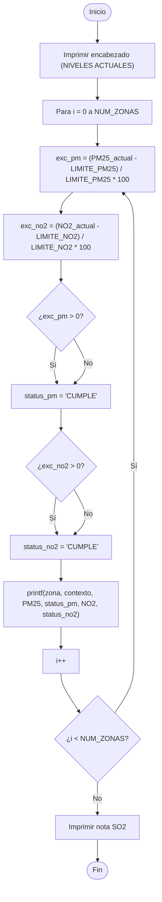

---

## 5. FUNCIÓN: req_mostrarAlertas()
**Archivo:** views.c  
**Descripción:** Muestra alertas actuales y preventivas (24h) basadas en OMS.

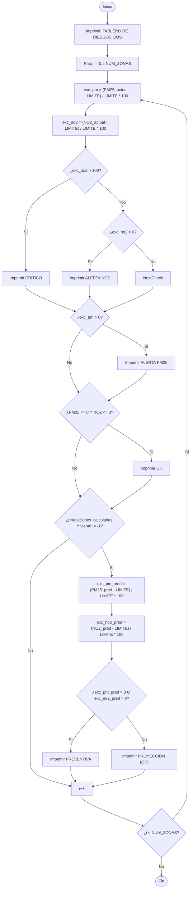

---

## 6. FUNCIÓN: req_promediosHistoricos()
**Archivo:** views.c  
**Descripción:** Calcula promedios de 30 días para PM2.5 y NO2, compara con OMS.

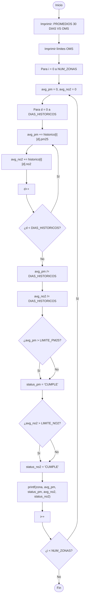

---

## 7. FUNCIÓN: req_generarRecomendaciones()
**Archivo:** views.c  
**Descripción:** Muestra recomendaciones dinámicas basadas en excedencias actuales y predichas.

```mermaid
flowchart TD
    Start([Inicio]) --> Print1["Imprimir: ESTRATEGIAS DE MITIGACION"]
    Print1 --> Loop["Para i = 0 a NUM_ZONAS"]
    
    Loop --> ExcedeAct1{¿PM25_actual > LIMITE?}
    ExcedeAct1 -->|Sí| ActPM["excede_actual_pm = 1"]
    ExcedeAct1 -->|No| ActPM["excede_actual_pm = 0"]
    
    ActPM --> ExcedeAct2{¿NO2_actual > LIMITE?}
    ExcedeAct2 -->|Sí| ActNO2["excede_actual_no2 = 1"]
    ExcedeAct2 -->|No| ActNO2["excede_actual_no2 = 0"]
    
    ActNO2 --> CheckPred{¿predicciones_calculadas Y viento != -1?}
    CheckPred -->|No| PredPM["excede_pred_pm = 0, excede_pred_no2 = 0"]
    CheckPred -->|Sí| ExcedePred1{¿PM25_pred > LIMITE?}
    
    ExcedePred1 -->|Sí| PredPM1["excede_pred_pm = 1"]
    ExcedePred1 -->|No| PredPM1["excede_pred_pm = 0"]
    
    PredPM1 --> ExcedePred2{¿NO2_pred > LIMITE?}
    ExcedePred2 -->|Sí| PredNO2["excede_pred_no2 = 1"]
    ExcedePred2 -->|No| PredNO2["excede_pred_no2 = 0"]
    
    PredPM --> PrintBase["printf(ZONA + ACCION BASE)"]
    PredNO2 --> PrintBase
    
    PrintBase --> CheckPMExit{¿excede_actual_pm O excede_pred_pm?}
    CheckPMExit -->|Sí| ActionPM["printf(ACCION: Suspender actividades)"]
    CheckPMExit -->|No| CheckNO2Exit
    
    ActionPM --> CheckNO2Exit{¿excede_actual_no2 O excede_pred_no2?}
    CheckNO2Exit -->|Sí| ActionNO2["printf(ACCION: Reducir tráfico)"]
    CheckNO2Exit -->|No| CheckAll
    
    ActionNO2 --> CheckAll{¿Todos los excedentes en 0?}
    CheckAll -->|Sí| ActionKeep["printf(ACCION: Mantener medidas)"]
    CheckAll -->|No| NextZona["i++"]
    ActionKeep --> NextZona
    NextZona --> ZonaCheck{¿i < NUM_ZONAS?}
    ZonaCheck -->|Sí| ExcedeAct1
    ZonaCheck -->|No| End([Fin])
```

---

## 8. FUNCIÓN: req_exportarDatos()
**Archivo:** export.c  
**Descripción:** Genera reporte TXT con datos actuales, predicciones y recomendaciones.

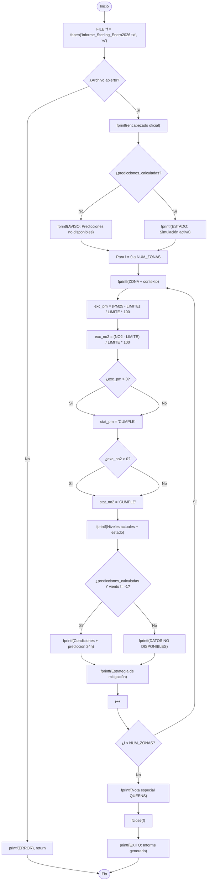

---

## 9. FUNCIÓN: inicializarDatosSterling()
**Archivo:** data.c  
**Descripción:** Carga datos iniciales hardcodeados de 5 zonas y genera históricos.

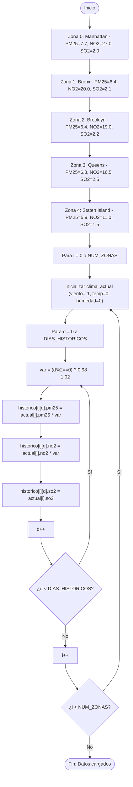

---

## 10. FUNCIÓN: guardarHistorico()
**Archivo:** data.c  
**Descripción:** Guarda históricos de 30 días en historico.csv (CSV).

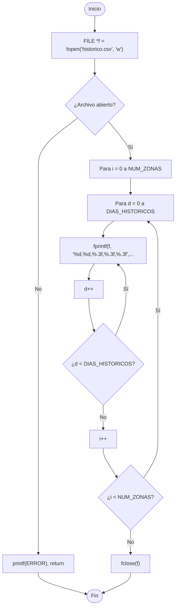

---

## 11. FUNCIÓN: cargarHistorico()
**Archivo:** data.c  
**Descripción:** Lee historico.csv y carga datos si existe.

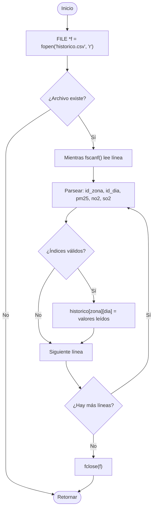

---

## 12. FUNCIÓN: guardarPredicciones()
**Archivo:** data.c  
**Descripción:** Guarda predicciones de 24h en predicciones.csv.

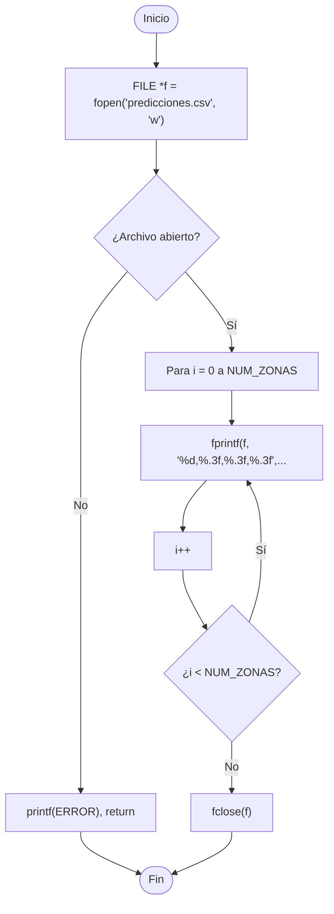

---

## 13. FUNCIÓN: seleccionarZona()
**Archivo:** util.c  
**Descripción:** Menú para elegir una zona (1-5) o volver (6).

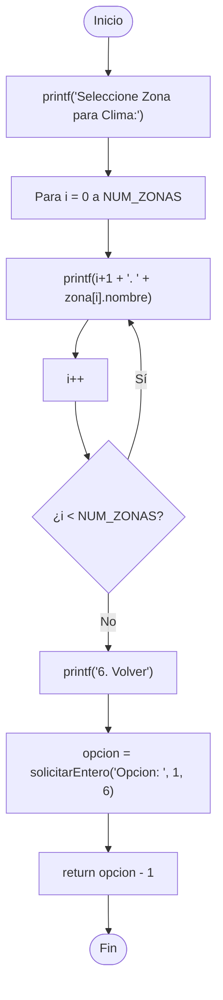

---

## 14. FUNCIÓN: solicitarEntrada()
**Archivo:** util.c  
**Descripción:** Lee un float dentro de rango [min, max], reintenta si es inválido.

```mermaid
flowchart TD
    Start([Inicio]) --> Loop["do-while"]
    Loop --> Print["printf(mensaje)"]
    Print --> Read["fgets(buffer, BUFFER_SIZE, stdin)"]
    Read --> Parse{¿sscanf() lee float?}
    
    Parse -->|No| Loop
    Parse -->|Sí| CheckRange{¿val >= min Y val <= max?}
    
    CheckRange -->|No| Loop
    CheckRange -->|Sí| Return["return val"]
    Return --> End([Fin])
```

---

## 15. FUNCIÓN: solicitarEntero()
**Archivo:** util.c  
**Descripción:** Lee un int dentro de rango [min, max], reintenta si es inválido.

```mermaid
flowchart TD
    Start([Inicio]) --> Loop["do-while"]
    Loop --> Print["printf(mensaje)"]
    Print --> Read["fgets(buffer, BUFFER_SIZE, stdin)"]
    Read --> Parse{¿sscanf() lee int?}
    
    Parse -->|No| Loop
    Parse -->|Sí| CheckRange{¿val >= min Y val <= max?}
    
    CheckRange -->|No| Loop
    CheckRange -->|Sí| Return["return val"]
    Return --> End([Fin])
```

---

## 16. FUNCIÓN: esperarEnter()
**Archivo:** util.c  
**Descripción:** Pausa el programa esperando que el usuario presione ENTER.

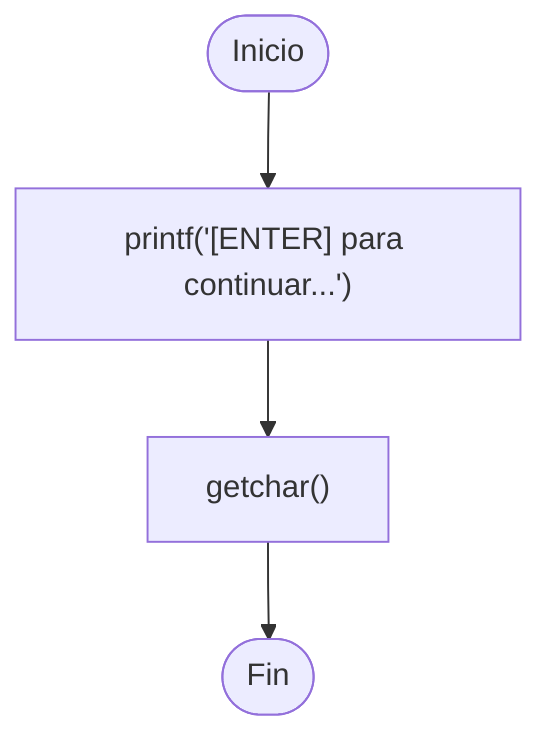

---

## RESUMEN DE FUNCIONES

| # | Función | Archivo | Descripción | Líneas |
|---|----------|---------|-------------|--------|
| 1 | main() | FinalProject.c | Orquestación y menú principal | ~60 |
| 2 | generarInterpretacionClimatica() | climate.c | Genera descripción textual de clima | ~15 |
| 3 | req_calcularPredicciones() | climate.c | Predicción a 24h con factores climáticos | ~60 |
| 4 | req_monitoreoActual() | views.c | Muestra niveles actuales | ~20 |
| 5 | req_mostrarAlertas() | views.c | Tablero de riesgos y alertas preventivas | ~30 |
| 6 | req_promediosHistoricos() | views.c | Promedios 30 días vs OMS | ~25 |
| 7 | req_generarRecomendaciones() | views.c | Acciones dinámicas por zona | ~35 |
| 8 | req_exportarDatos() | export.c | Genera reporte TXT meticuloso | ~80 |
| 9 | inicializarDatosSterling() | data.c | Carga datos iniciales + históricos | ~70 |
| 10 | guardarHistorico() | data.c | Escribe historico.csv | ~15 |
| 11 | cargarHistorico() | data.c | Lee historico.csv | ~15 |
| 12 | guardarPredicciones() | data.c | Escribe predicciones.csv | ~15 |
| 13 | seleccionarZona() | util.c | Menú de selección de zona | ~10 |
| 14 | solicitarEntrada() | util.c | Entrada de float validada | ~12 |
| 15 | solicitarEntero() | util.c | Entrada de int validada | ~12 |
| 16 | esperarEnter() | util.c | Pausa hasta ENTER | ~1 |

---

## CÓMO USAR EN MERMAID.LIVE

1. Ve a [https://mermaid.live](https://mermaid.live)
2. Copia el código Mermaid de cada función desde la sección correspondiente (entre los triples backticks ``` ```mermaid```)
3. Pégalo en el editor Mermaid.live
4. El diagrama se renderizará automáticamente
5. Puedes descargar como PNG/SVG desde el botón de descarga

Cada diagrama muestra:
- **Nodos redondeados []()**: Inicio/Fin
- **Rectángulos []**: Procesos/Asignaciones
- **Rombos {}**: Decisiones/Condiciones
- **Flechas**: Flujo de control con etiquetas (Sí/No para decisiones)
